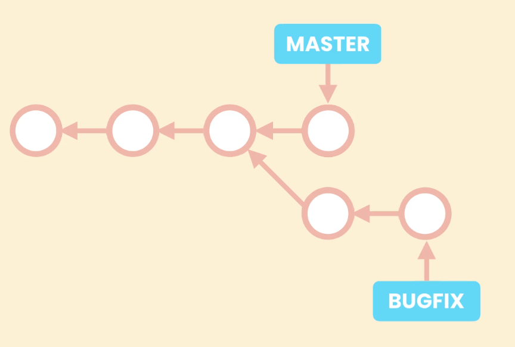
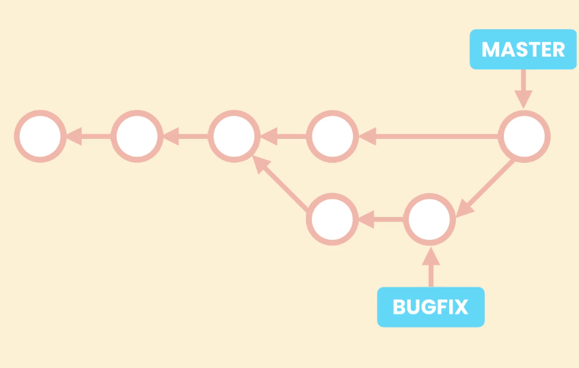

# Branching

```shell
git branch

git branch -m new-name

git branch -M new-name
// rename a branch with force

git branch -M old-name new-name
```

```shell
// switch to a new branch
git checkout branch-name
git switch branch-name

// switch and create new branch
git checkout -b new-branch-name
git switch -c new-branch-name

// switching to commit
git checkout commit-id

```

## Merging

### Fast forward merge

All git has to do is to bring master forward
// linear path to merge

```shell
git switch main
git merge branch-to-be-merged
```

### 3 way merge



merging



```shell
git merge --no-ff
```
